# 部署指南

本文档详细说明了如何部署 VideoAll 项目到生产环境。

## 📋 目录

- [前置要求](#前置要求)
- [环境配置](#环境配置)
- [Docker 部署](#docker部署)
- [GitHub Actions CI/CD](#github-actions-cicd)
- [版本发布](#版本发布)
- [监控和维护](#监控和维护)
- [故障排除](#故障排除)

## 🔧 前置要求

### 系统要求

- **操作系统**: Linux (Ubuntu 20.04+ 推荐)
- **CPU**: 2 核心以上
- **内存**: 4GB 以上
- **存储**: 20GB 以上可用空间
- **网络**: 稳定的互联网连接

### 软件要求

- **Docker**: 20.10+
- **Docker Compose**: 2.0+
- **Git**: 2.0+
- **Node.js**: 22.x (用于本地开发)

### 安装 Docker 和 Docker Compose

```bash
# Ubuntu/Debian
curl -fsSL https://get.docker.com -o get-docker.sh
sudo sh get-docker.sh
sudo usermod -aG docker $USER

# 安装Docker Compose
sudo curl -L "https://github.com/docker/compose/releases/latest/download/docker-compose-$(uname -s)-$(uname -m)" -o /usr/local/bin/docker-compose
sudo chmod +x /usr/local/bin/docker-compose

# 验证安装
docker --version
docker-compose --version
```

## ⚙️ 环境配置

### 1. 克隆项目

```bash
git clone https://github.com/your-username/videoAll.git
cd videoAll
```

### 2. 配置环境变量

```bash
# 复制环境变量模板
cp .env.example .env

# 编辑环境变量
nano .env
```

### 关键配置项

```bash
# 应用配置
NODE_ENV=production
BACKEND_PORT=3000
FRONTEND_PORT=80

# 数据库配置（重要：修改默认密码）
POSTGRES_PASSWORD=your-secure-password-here

# JWT配置（重要：使用强密钥）
JWT_SECRET=your-super-secret-jwt-key-change-this-in-production

# 可选：Slack通知
SLACK_WEBHOOK=https://hooks.slack.com/services/YOUR/SLACK/WEBHOOK
```

## 🐳 Docker 部署

### 快速部署

```bash
# 使用部署脚本（推荐）
./scripts/deploy.sh

# 或手动部署
docker-compose up -d
```

### 分步部署

```bash
# 1. 构建镜像
docker-compose build

# 2. 启动数据库
docker-compose up -d postgres redis

# 3. 等待数据库启动
sleep 30

# 4. 启动应用服务
docker-compose up -d backend frontend

# 5. 检查服务状态
docker-compose ps
```

### 验证部署

```bash
# 检查服务健康状态
curl http://localhost:3000/api/v1/health

# 检查前端访问
curl http://localhost/health

# 查看日志
docker-compose logs -f
```

## 🚀 GitHub Actions CI/CD

### 1. 配置 GitHub Secrets

在 GitHub 仓库设置中添加以下 Secrets：

```
GITHUB_TOKEN: 自动生成，用于推送镜像到GHCR
SLACK_WEBHOOK: Slack通知webhook URL（可选）
```

### 2. 启用 GitHub Container Registry

```bash
# 登录GHCR
echo $GITHUB_TOKEN | docker login ghcr.io -u USERNAME --password-stdin

# 推送镜像
docker tag your-image ghcr.io/username/videoall-backend:latest
docker push ghcr.io/username/videoall-backend:latest
```

### 3. 工作流触发条件

- **推送到 main 分支**: 自动构建和部署
- **推送到 develop 分支**: 构建测试镜像
- **创建标签**: 创建正式发布版本
- **Pull Request**: 运行测试和代码检查

### 4. 部署流程

```mermaid
graph LR
    A[代码提交] --> B[GitHub Actions]
    B --> C[代码检查]
    C --> D[运行测试]
    D --> E[构建镜像]
    E --> F[安全扫描]
    F --> G[推送镜像]
    G --> H[创建发布]
    H --> I[部署通知]
```



## 📦 版本发布

### 自动发布

```bash
# 使用发布脚本
./scripts/release.sh 1.2.3

# 预览模式
./scripts/release.sh 1.2.3 --dry-run
```

### 手动发布

```bash
# 1. 更新版本号
npm version 1.2.3

# 2. 创建标签
git tag -a v1.2.3 -m "Release version 1.2.3"

# 3. 推送标签
git push origin v1.2.3
```

### 发布流程

1. **版本号更新**: 自动更新 package.json 中的版本号
2. **变更日志生成**: 基于 Git 提交历史生成 CHANGELOG.md
3. **标签创建**: 创建 Git 标签
4. **镜像构建**: GitHub Actions 自动构建 Docker 镜像
5. **发布创建**: 在 GitHub 上创建 Release
6. **通知发送**: 发送部署通知

## 📊 监控和维护

### 健康检查端点

```bash
# 应用健康状态
GET /api/v1/health

# 服务就绪状态
GET /api/v1/health/ready

# 服务存活状态
GET /api/v1/health/live
```

### 日志管理

```bash
# 查看所有服务日志
docker-compose logs

# 查看特定服务日志
docker-compose logs backend
docker-compose logs frontend

# 实时日志
docker-compose logs -f

# 限制日志行数
docker-compose logs --tail=100
```

### 数据备份

```bash
# 手动备份
docker-compose exec postgres pg_dump -U postgres video_all > backup.sql

# 自动备份（通过cron）
0 2 * * * /path/to/backup-script.sh
```

### 性能监控

```bash
# 查看资源使用情况
docker stats

# 查看容器状态
docker-compose ps

# 查看系统资源
htop
df -h
```

## 🔧 故障排除

### 常见问题

#### 1. 数据库连接失败

```bash
# 检查数据库状态
docker-compose logs postgres

# 重启数据库
docker-compose restart postgres

# 检查连接
docker-compose exec postgres psql -U postgres -d video_all -c "SELECT 1;"
```

#### 2. 前端无法访问

```bash
# 检查前端日志
docker-compose logs frontend

# 检查nginx配置
docker-compose exec frontend nginx -t

# 重启前端服务
docker-compose restart frontend
```

#### 3. 后端 API 错误

```bash
# 检查后端日志
docker-compose logs backend

# 检查环境变量
docker-compose exec backend env | grep -E "(NODE_ENV|POSTGRES|JWT)"

# 重启后端服务
docker-compose restart backend
```

#### 4. 镜像构建失败

```bash
# 清理Docker缓存
docker system prune -a

# 重新构建镜像
docker-compose build --no-cache

# 检查Dockerfile语法
docker build -t test-image ./backend
```

### 性能优化

#### 1. 数据库优化

```sql
-- 创建索引
CREATE INDEX idx_content_created_at ON contents(created_at);
CREATE INDEX idx_content_platform ON contents(platform);

-- 分析查询性能
EXPLAIN ANALYZE SELECT * FROM contents WHERE platform = 'xiaohongshu';
```

#### 2. 应用优化

```bash
# 启用生产模式
NODE_ENV=production

# 配置PM2（可选）
npm install -g pm2
pm2 start ecosystem.config.js
```

#### 3. 网络优化

```nginx
# nginx配置优化
gzip on;
gzip_types text/plain text/css application/json application/javascript;

# 缓存静态资源
location ~* \.(js|css|png|jpg|jpeg|gif|ico|svg)$ {
    expires 1y;
    add_header Cache-Control "public, immutable";
}
```

### 安全加固

#### 1. 防火墙配置

```bash
# Ubuntu UFW
sudo ufw allow 22/tcp
sudo ufw allow 80/tcp
sudo ufw allow 443/tcp
sudo ufw enable
```

#### 2. SSL 证书

```bash
# 使用Let's Encrypt
sudo apt install certbot
sudo certbot --nginx -d yourdomain.com
```

#### 3. 定期更新

```bash
# 更新系统
sudo apt update && sudo apt upgrade

# 更新Docker镜像
docker-compose pull
docker-compose up -d
```

## 📞 支持

如果遇到问题，请：

1. 查看[故障排除](#故障排除)部分
2. 检查[GitHub Issues](https://github.com/your-username/videoAll/issues)
3. 创建新的 Issue 并提供详细信息

## 📝 更新日志

查看[CHANGELOG.md](CHANGELOG.md)了解版本更新信息。
